#  SendMoneyApp

##  Installation DEMO APK 
**donwload apk from below link adn use below creds to log in**
**apk link** : https://drive.google.com/file/d/1IqeGt24N_OMj7EoqpEai9UlIeVl1WjZK/view

## Login Credentials
**username** = "testuser"
**password** = "password123"

## overview
A simple **money transfer Android app** built with **Kotlin & Jetpack Compose**.  
This project demonstrates **Clean Architecture, MVVM**, and practical Android development skills.

---  

##  Screenshots

<i>✨ Click images to view full-size</i>

  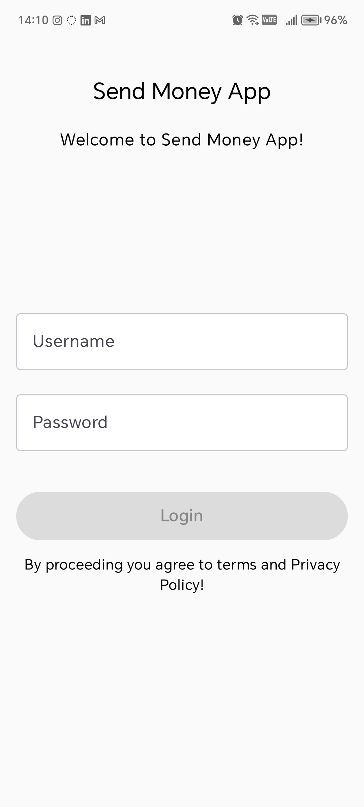
  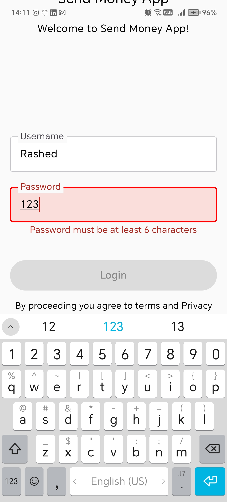
  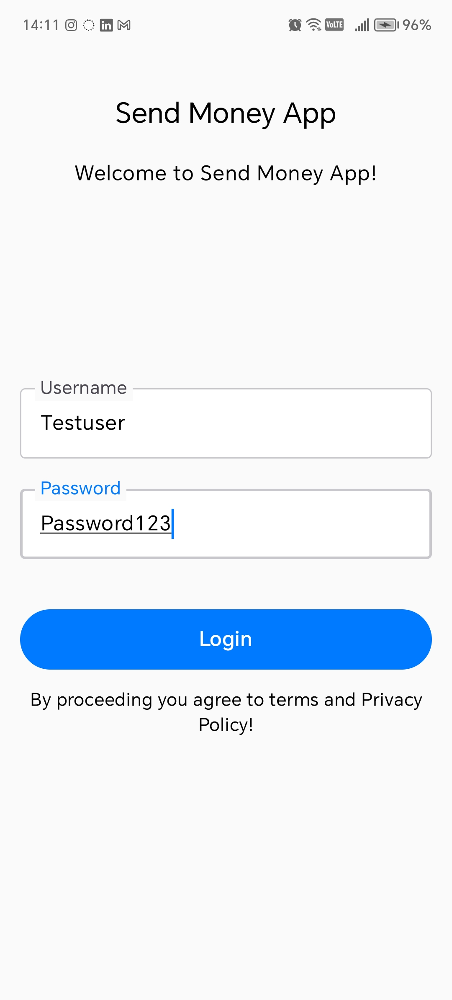

 
 

  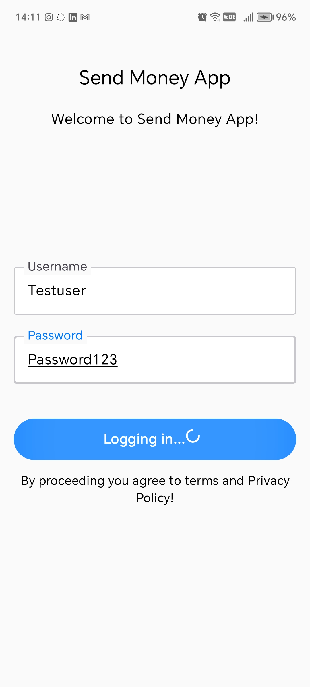
  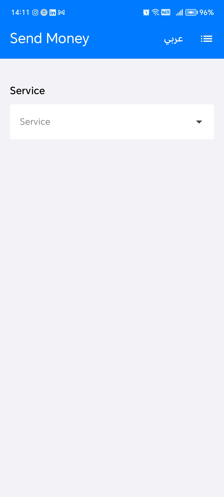
  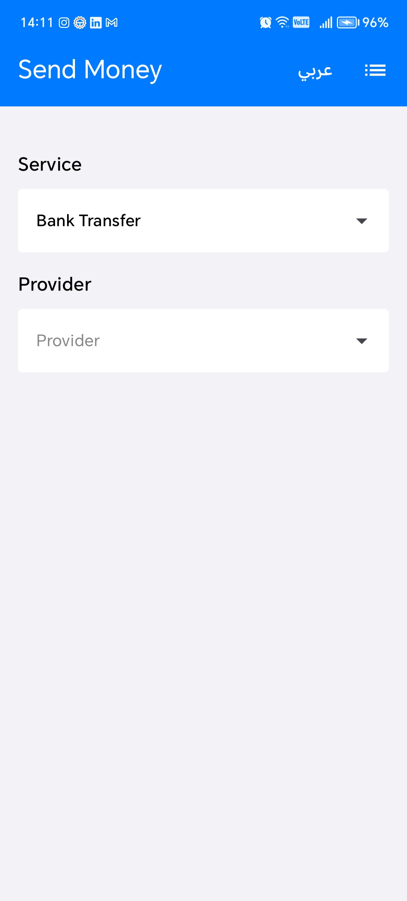

 
 

  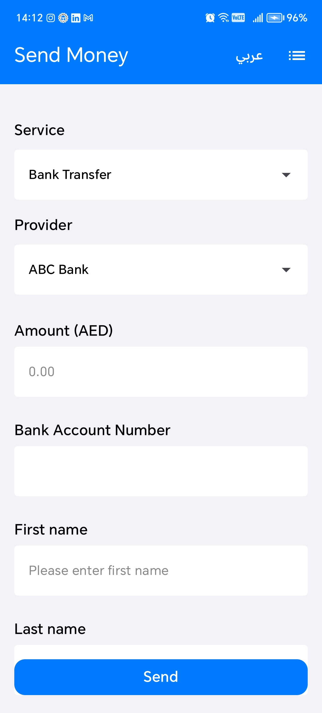
  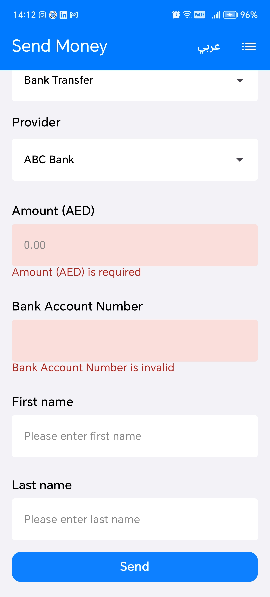
  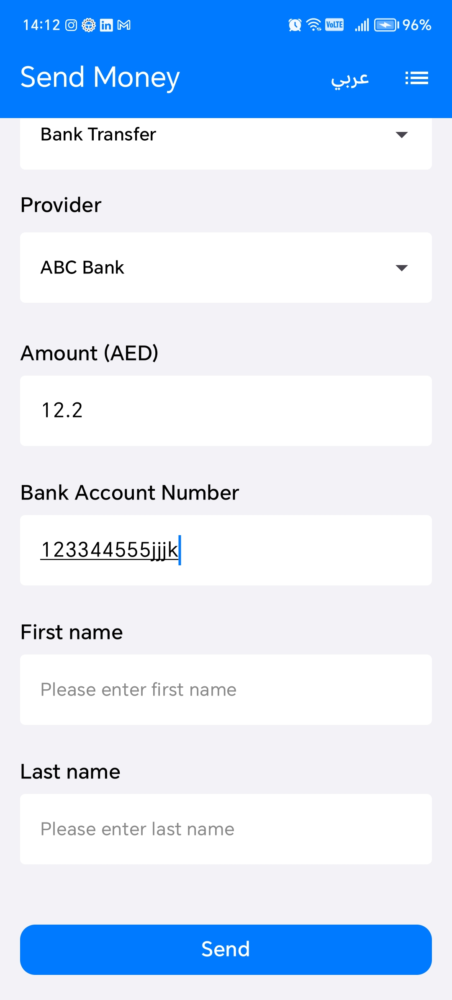

 
 

  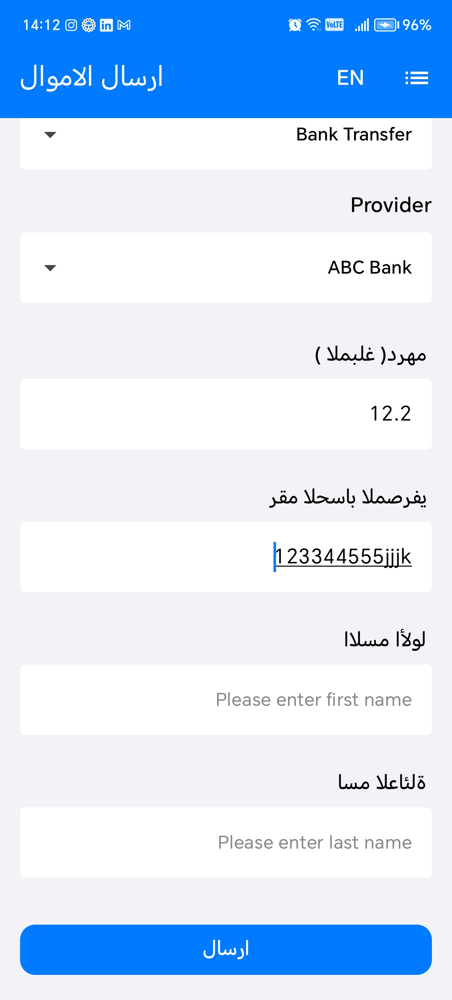
  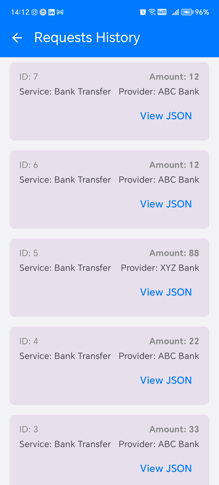
  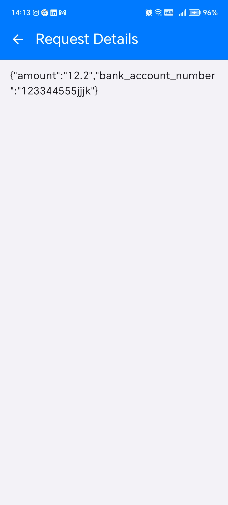

 
 

---

## 🎥 Demo Video

  

<i>Click the thumbnail to watch the demo video</i>

---

## 🏗 Architecture Overview

This app follows **MVVM with Clean Architecture principles**.
Architecture

This project follows a Clean Architecture approach combined with MVVM (Model-View-ViewModel) and Jetpack Compose for UI, ensuring modularity, testability, and maintainability.

**Layers**
1. **Presentation Layer (Compose + ViewModel)**

Utilizes Jetpack Compose for declarative UI.

ViewModels hold UI state via StateFlow and handle user events.

Observes domain/use case results and exposes state to the UI.

Handles screen navigation and side effects (e.g., Toast, SnackBar, navigation events).

2. **Domain Layer (Use Cases / Business Logic)**

Encapsulates all business rules and validation logic.

Defines Use Cases (interactors) for actions like login, fetching request history, or validating input.

Independent of Android framework or implementation details.

Returns results in a functional style using Arrow Core Either to represent success/failure.

3. **Data Layer (Repository + Remote/Local Sources)**

Repository interfaces defined in the domain layer and implemented here.

Fetches data from remote APIs (Retrofit) and local sources (Room / DataStore).

Maps DTOs to domain models and handles caching when necessary.

Abstracts data sources so the domain layer remains unaware of implementation details.

**Additional Patterns & Tools**
**Room Database** : is sued to save request of send money and display history 

**Dependency Injection**: Hilt provides repositories, use cases, and ViewModels in a clean and testable way.

**State Managemen**t: MutableStateFlow / StateFlow is used in ViewModels for reactive UI updates.

**Error Handling**: Functional Either types separate success and failure paths for login .

**Form Validation**: Validation logic resides in the domain/use-case layer to maintain separation of concerns.

**Navigation**: Jetpack Compose Navigation handles screen transitions with proper back-stack management.

**Theming**: Material 3 with custom color schemes ensures a consistent UI experience.

**Benefits**

Clear separation of concerns between UI, business logic, and data sources.

Simplified unit testing of ViewModels and use cases.

Scalable architecture: new features can be added without tightly coupling components.

Reactive and declarative UI using Jetpack Compose.
---

## ✨ Features

- 🔑 **User Authentication** (Login) use thises User Name= testuser  , password = password123
- 💸 **Send Money** dynamice filed genration bassed on the json data provided  
- 📜 **View Transaction History**   list of history trsacatino sent useing room db
- ✅ **Form Validation & Error Handling**   bassed on the json file provided
- 📱 **Modern UI with Jetpack Compose**  
- ⚡ **Responsive and Clean Architecture**  

---

## 🚀 Installation
**run the app and use creds**
**user name** = "testuser"
**password** = "password123"

1. **Clone the repository**:
  
   git clone https://github.com/rashedalemaddev/SendMoneyApp_Rashed_Alemad.git
